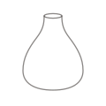

# Site de Marie D’Antoni, céramiste

Site vitrine de Marie D’Antoni, céramiste. C’est un site **statique** (HTML, CSS et un peu de JavaScript), sans framework, sans base de données et sans outil de construction : chaque page est un fichier que l’on peut ouvrir et modifier directement.

- Publication : **GitHub Pages**, depuis la branche `main`, à la racine du dépôt.
- Adresse : **https://marie-d-antoni.github.io/** (organisation GitHub `Marie-d-antoni`, dépôt `marie-d-antoni.github.io`).
- Langue : français.

## Les pages

| Fichier | Page |
|---|---|
| `index.html` | Accueil : texte de présentation de Marie, CASA (l’atelier), blocs vers les autres pages, prestations pour les structures |
| `presentation.html` | À propos : « Quelques mots sur moi », venir à l’atelier |
| `ateliers.html` | Ateliers : modelage, émaillage, parent-enfant, stage enfants, prestations, réservation et coordonnées |
| `rendez-vous.html` | Ancienne page, remplacée par `ateliers.html` : elle renvoie automatiquement vers la réservation des ateliers |
| `ateliers-entreprise.html` | Ateliers en entreprise : formules, déroulé, questions fréquentes, demande de devis |
| `boutique.html` | Shop : grille des pièces (prix à venir, pas de paiement en ligne) |
| `mentions-legales.html` | Mentions légales (liées dans le pied de page) |
| `404.html` | Page affichée quand une adresse n’existe pas |

## Où modifier quoi

- **Textes** : directement dans chaque fichier `.html`.
- **Informations manquantes** : elles sont marquées `[à compléter]` (visible sur le site, sur fond légèrement teinté) ou par un commentaire `<!-- À COMPLÉTER -->` dans le code. Pour toutes les retrouver :
  ```
  grep -n "à compléter\|À COMPLÉTER\|PHOTO À VENIR" *.html
  ```
- **Menu et pied de page** : ils sont répétés dans chaque page. Le menu contient Accueil, À propos, Ateliers et Shop (un Blog viendra plus tard). Une modification du menu ou du pied de page se fait dans toutes les pages `.html` (sauf `rendez-vous.html`, qui n’est plus qu’un renvoi).
- **Textes de Marie** : ils sont repérés par un commentaire `<!-- Texte de Marie (texte N) -->`. Les retours à la ligne et l’absence de points y sont voulus.
- **Couleurs, polices, espacements** : en haut de `css/style.css`, dans le bloc `:root`.
- **Menu mobile et animations** : `js/main.js`.
- **Réservation** : les boutons « Réserver un atelier » mènent à la page `ateliers.html` (section `#reserver` : email et WhatsApp). Si Marie choisit un outil de réservation en ligne, c’est là qu’on mettra le lien.

## Photos

Les photos vont dans `img/`. Pour l’instant, chaque photo est remplacée par un emplacement provisoire « Photo à venir » :

```html
<div class="cadre cadre--4x5 ton-terre">
  <span class="a-venir">Photo à venir</span>
</div>
```

Pour mettre une vraie photo, on garde le cadre et on remplace la ligne `<span class="a-venir">…</span>` par :

```html

```

Règles :
- la photo doit avoir **le même format que son cadre** (`cadre--4x5` = portrait 4:5, `cadre--4x3` = paysage 4:3, `cadre--3x2` = paysage 3:2), sinon elle paraît coupée ;
- 1 600 px maximum de côté, JPEG qualité 80 à 85, moins de 350 Ko ;
- une photo remplacée prend un nouveau nom (`-2`, `-3`…), sinon les navigateurs gardent l’ancienne en mémoire.

Les dessins de `img/formes/` (bol, tasse, vase…) servent seulement aux emplacements provisoires.

## Cache

Après une modification de `css/style.css` ou de `js/main.js`, augmenter le numéro `?v=N` dans **toutes** les pages (`style.css?v=1` devient `style.css?v=2`). Si un changement ne se voit pas, recharger en forçant : Cmd+Maj+R (Mac) ou Ctrl+F5 (PC).

## Voir le site sur son ordinateur

Dans le dossier du site :

```
python3 -m http.server 8001
```

puis ouvrir http://localhost:8001/ dans le navigateur. (N’importe quel port libre convient.)

## Mettre en ligne

Un commit par modification, puis `git push` sur la branche `main`. GitHub Pages met le site à jour en une à deux minutes.

## Liens et adresse du site

- Tous les liens sont **relatifs** (`presentation.html`, `css/style.css`…), jamais `/presentation.html` : le site marche à la racine comme dans un sous-dossier, et le nom du dossier local n’a pas d’importance.
- L’adresse complète du site n’apparaît qu’à ces endroits : en haut de chaque page, les balises de partage (`og:url`, `og:image`) et l’adresse de référence (`<link rel="canonical">`) ; le plan du site `sitemap.xml` ; le fichier `robots.txt` ; et ce fichier. Si l’adresse change (nom de domaine, par exemple), il faut modifier ces lignes et ajouter un fichier `CNAME`. Pour les retrouver :
  ```
  grep -rn "marie-d-antoni.github.io" --include=*.html --include=*.xml --include=*.txt .
  ```
- `img/partage-3.jpg` (1 200 × 630 px, nom et métier seulement, sans phrase à tenir à jour) est l’image qui s’affiche quand on partage un lien du site (messageries, réseaux). Elle pourra être remplacée par une vraie photo au même format.
- Police : Karla, pour les titres comme pour le texte (depuis le 08/10/2026), chargée depuis Google Fonts.
